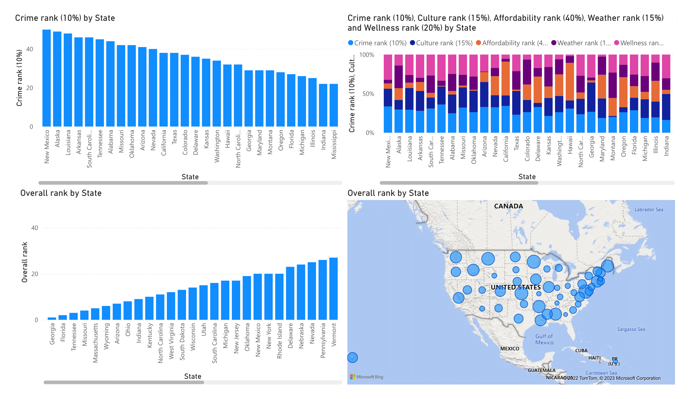

# States

Link: [States](https://www.bankrate.com/finance/retirement/best-places-retire-how-state-ranks.aspx)

## 1. Create an overview report

## 2. Quantify the correlations

Is there a correlations between the different states measurements?  
If so, how would you quantify it?

Tip: [Correlations](../../Chapter%203%20-%20Correlations/Overview)

### Make a new report (sheet) with the implementation of your correlation coefficient.