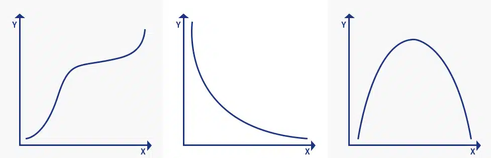

The Spearman rank correlation coefficient, also known as the Spearman's rho,
is a statistical measure used to assess the strength and direction of the `monotonic` relationship between two
continuous or ordinal variables.
Unlike Pearson's correlation, which measures the `linear` relationship between variables, the Spearman rank correlation
measures the `rank-based` relationship between variables.

Named after Charles Spearman, it is often denoted by the Greek letter $$ρ$$ (rho) and is primarily used for data
analysis.

## Monotonic

It is necessary to know what monotonic function is to understand Spearman correlation coefficient.
A monotonic function is one that either never decreases or never increases as it is an independent variable increase.
A monotonic function can be explained using the image below:

The image explains three concepts in monotonic function:

1. Monotonically increasing:  
   When the ‘x’ variable increases and the ‘y’ variable never decreases.
2. Monotonically decreasing:  
   When the ‘x’ variable increases but the ‘y’ variable never increases
2. Not monotonic:  
   When the ‘x’ variable increases and the ‘y’ variable sometimes increases and sometimes decreases.

Monotonic relation is less restrictive when compared to a linear relationship that is used in Pearson’s coefficient.
Although monotonicity is not the ultimate requirement for Spearman correlation coefficient, it will not be meaningful to
pursue Spearman’s correlation without actually determining the strength and direction of a monotonic relationship if it
was already known that the relationship between the variable is non-monotonic.

## Formula

$$
ρ = 1−\frac{6∑d²}{n(n-1)}
$$

where,

$$
n = number\ of\ data\ points\ of\ the\ two\ variables
\\\
di = difference\ in\ ranks\ of\ the\ "ith"\ element
$$

The Spearman Coefficient,⍴, can take a value between +1 to -1

where,

- A $$⍴$$ value of +1 means a perfect association of rank  
- A $$⍴$$ value of 0 means no association of ranks 
- A $$⍴$$ value of -1 means a perfect negative association between ranks. 

The closer the $$⍴$$ value is to 0, the weaker the association is between the two ranks.

## Example

Consider the following data on the exam scores (out of 100) and the number of hours spent studying by 10 students:

### Step 1: Collect and Organize Data

In this example we have 15 students and their scores in two exams: Math and English.

<table class="GeneratedTable">
   <caption>Spearman Example</caption>
  <thead>
    <tr>
      <th>Student</th>
      <th>Math Score</th>
      <th>English Score</th>
    </tr>
  </thead>
  <tbody>
    <tr>
      <td>A</td>
      <td>90</td>
      <td>85</td>
    </tr>
    <tr>
      <td>B</td>
      <td>85</td>
      <td>90</td>
    </tr>
    <tr>
      <td>C</td>
      <td>92</td>
      <td>88</td>
    </tr>
    <tr>
      <td>D</td>
      <td>78</td>
      <td>80</td>
    </tr>
    <tr>
      <td>E</td>
      <td>89</td>
      <td>82</td>
    </tr>
    <tr>
      <td>F</td>
      <td>80</td>
      <td>79</td>
    </tr>
    <tr>
      <td>G</td>
      <td>85</td>
      <td>86</td>
    </tr>
    <tr>
      <td>H</td>
      <td>92</td>
      <td>94</td>
    </tr>
    <tr>
      <td>I</td>
      <td>88</td>
      <td>87</td>
    </tr>
    <tr>
      <td>J</td>
      <td>83</td>
      <td>82</td>
    </tr>
    <tr>
      <td>K</td>
      <td>75</td>
      <td>77</td>
    </tr>
    <tr>
      <td>L</td>
      <td>90</td>
      <td>92</td>
    </tr>
    <tr>
      <td>M</td>
      <td>80</td>
      <td>85</td>
    </tr>
    <tr>
      <td>N</td>
      <td>87</td>
      <td>88</td>
    </tr>
    <tr>
      <td>O</td>
      <td>75</td>
      <td>70</td>
    </tr>
  </tbody>
</table>

### Step 2: Rank the Data

We need to rank the data based on each student's scores in each exam. 
We will use the fractional method to assign ranks. 
In this method, the rank of a value is equal to the average of its position in the list and its position in the list after ties are resolved.

#### Competition

In the competition method, each score is assigned a rank based on its position in the ordered list.  
If there are ties, i.e. multiple scores have the same value, then the average of the ranks that would have been assigned to those scores is assigned to all of them. 

For example, if three scores have the same value and would have been assigned ranks of 3, 4, and 5, then they would all be assigned a rank of 4.

#### Fractional

In the fractional method, each score is assigned a rank based on its position in the ordered list, but with the addition of a fraction to account for ties.   
The fraction is equal to the number of tied scores minus one, divided by two. 

For example, if two scores have the same value and would have been assigned ranks of 3 and 4, then they would be assigned ranks of 3.5 and 4.5, respectively.

In this example, we used the fractional method to calculate the ranks.

<table class="GeneratedTable">
<caption>Spearman Example s1</caption>
  <thead>
    <tr>
      <th>Student</th>
      <th>Math Score</th>
      <th>Math Rank</th>
      <th>English Score</th>
      <th>English Rank</th>
    </tr>
  </thead>
  <tbody>
    <tr>
      <td>A</td>
      <td>90</td>
      <td>11</td>
      <td>85</td>
      <td>10,5</td>
    </tr>
    <tr>
      <td>B</td>
      <td>85</td>
      <td>7</td>
      <td>90</td>
      <td>13</td>
    </tr>
    <tr>
      <td>C</td>
      <td>92</td>
      <td>13</td>
      <td>88</td>
      <td>9</td>
    </tr>
    <tr>
      <td>D</td>
      <td>78</td>
      <td>2</td>
      <td>80</td>
      <td>2</td>
    </tr>
    <tr>
      <td>E</td>
      <td>89</td>
      <td>9</td>
      <td>82</td>
      <td>5,5</td>
    </tr>
    <tr>
      <td>F</td>
      <td>80</td>
      <td>3</td>
      <td>79</td>
      <td>1,5</td>
    </tr>
    <tr>
      <td>G</td>
      <td>85</td>
      <td>7</td>
      <td>86</td>
      <td>7</td>
    </tr>
    <tr>
      <td>H</td>
      <td>92</td>
      <td>13</td>
      <td>94</td>
      <td>15</td>
    </tr>
    <tr>
      <td>I</td>
      <td>88</td>
      <td>10</td>
      <td>87</td>
      <td>8</td>
    </tr>
    <tr>
      <td>J</td>
      <td>83</td>
      <td>5</td>
      <td>82</td>
      <td>5,5</td>
    </tr>
    <tr>
      <td>K</td>
      <td>75</td>
      <td>1</td>
      <td>77</td>
      <td>1</td>
    </tr>
    <tr>
      <td>L</td>
      <td>90</td>
      <td>11</td>
      <td>92</td>
      <td>12</td>
    </tr>
    <tr>
      <td>M</td>
      <td>80</td>
      <td>3</td>
      <td>85</td>
      <td>10,5</td>
    </tr>
    <tr>
      <td>N</td>
      <td>87</td>
      <td>10</td>
      <td>88</td>
      <td>9</td>
    </tr>
    <tr>
      <td>O</td>
      <td>75</td>
      <td>1</td>
      <td>70</td>
      <td>1</td>
    </tr>
  </tbody>
</table>

### Step 3: Calculate the Difference in Ranks

We need to calculate the difference in ranks for each student between the two exams.  
We need to square the difference in ranks for each student.

<table class="GeneratedTable">
<caption>Spearman Example s2</caption>
  <thead>
    <tr>
      <th>Student</th>
      <th>Math Rank</th>
      <th>English Rank</th>
      <th>Rank Difference</th>
      <th>Difference Squared</th>
    </tr>
  </thead>
  <tbody>
    <tr>
      <td>A</td>
      <td>11</td>
      <td>10,5</td>
      <td>0,5</td>
      <td>0,25</td>
    </tr>
    <tr>
      <td>B</td>
      <td>7</td>
      <td>13</td>
      <td>-6</td>
      <td>36</td>
    </tr>
    <tr>
      <td>C</td>
      <td>13</td>
      <td>9</td>
      <td>4</td>
      <td>16</td>
    </tr>
    <tr>
      <td>D</td>
      <td>2</td>
      <td>2</td>
      <td>0</td>
      <td>0</td>
    </tr>
    <tr>
      <td>E</td>
      <td>9</td>
      <td>5,5</td>
      <td>3,5</td>
      <td>12,25</td>
    </tr>
    <tr>
      <td>F</td>
      <td>3</td>
      <td>1,5</td>
      <td>1,5</td>
      <td>2,25</td>
    </tr>
    <tr>
      <td>G</td>
      <td>7</td>
      <td>7</td>
      <td>0</td>
      <td>0</td>
    </tr>
    <tr>
      <td>H</td>
      <td>13</td>
      <td>15</td>
      <td>-2</td>
      <td>4</td>
    </tr>
    <tr>
      <td>I</td>
      <td>10</td>
      <td>8</td>
      <td>2</td>
      <td>4</td>
    </tr>
    <tr>
      <td>J</td>
      <td>5</td>
      <td>5,5</td>
      <td>-0,5</td>
      <td>0,25</td>
    </tr>
    <tr>
      <td>K</td>
      <td>1</td>
      <td>1</td>
      <td>0</td>
      <td>0</td>
    </tr>
    <tr>
      <td>L</td>
      <td>11</td>
      <td>12</td>
      <td>-1</td>
      <td>1</td>
    </tr>
    <tr>
      <td>M</td>
      <td>3</td>
      <td>10,5</td>
      <td>-7,5</td>
      <td>56,25</td>
    </tr>
    <tr>
      <td>N</td>
      <td>10</td>
      <td>9</td>
      <td>1</td>
      <td>1</td>
    </tr>
    <tr>
      <td>O</td>
      <td>1</td>
      <td>1</td>
      <td>0</td>
      <td>0</td>
    </tr>
  </tbody>
</table>

### Step 4: Calculate the Spearman Correlation Coefficient

We need to calculate the Spearman correlation coefficient by using the formula:

$$
r = 1 - \frac{(6\ x\ sum\ of\ squared\ rank\ differences)}{(n*(n^2 - 1))}
$$

where,

n is the number of data points sum of squared rank differences is the sum of the difference squared values we calculated in step 3

In our case, n = 15, and the sum of squared rank differences is 133.25, so:

$$
r = 1 - \frac{(6*133.25)}{(15*(15^2 - 1))}
\\\
\\\
r = 1 - \frac{(6*133.25)}{(15*224)}
\\\
\\\
r = 1 - 0.2379
\\\
\\\
r = 0.7621
$$

Therefore, the Spearman correlation coefficient between the Math and English scores of the 15 students is 0.6042, indicating a moderate positive correlation between the two variables,