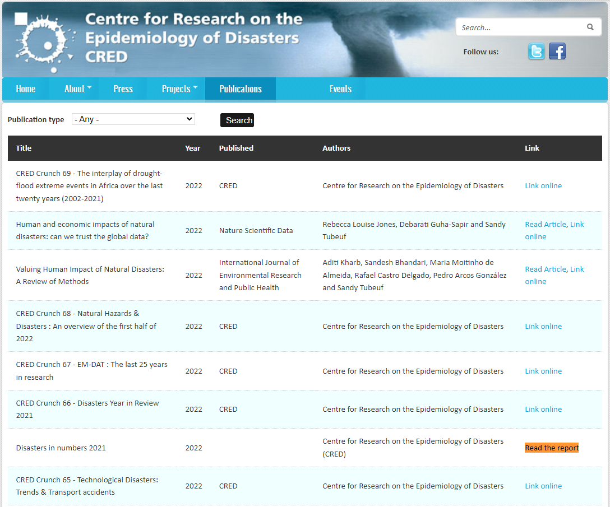
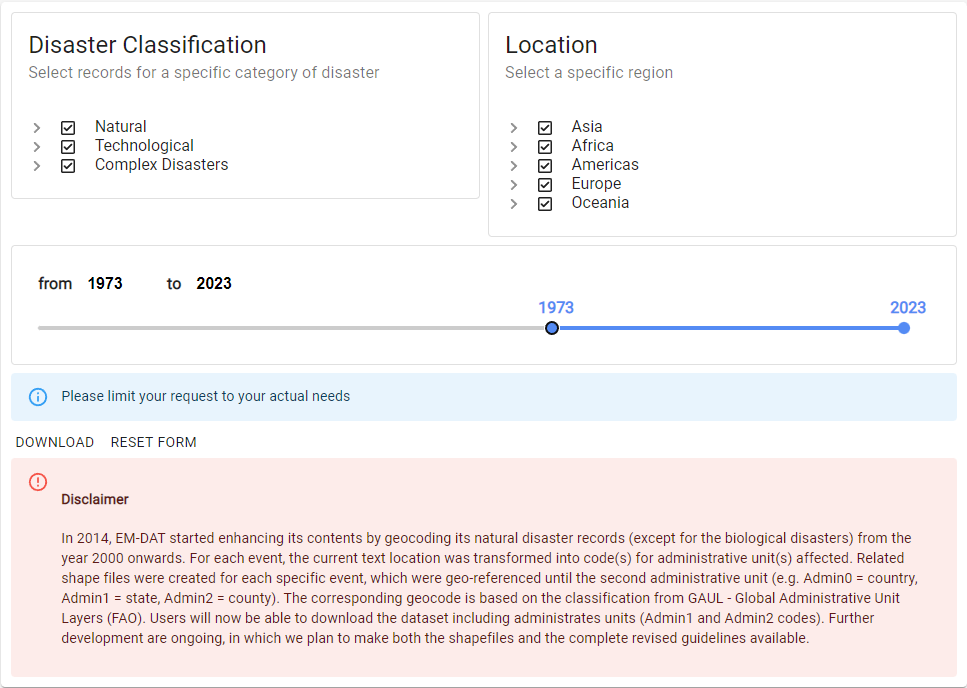

# EM-DAT

The Centre for Research on the Epidemiology of Disasters (CRED) within the Université catholique de Louvain (UCLouvain) provides free access to the full Emergency Events Database (EM-DAT)
for non-commercial purposes.  
Users on behalf of academic organizations, universities, non-profit organisations and/or international public organization 
(UN agencies, multi-lateral banks, other multi-lateral institution and national governments), 
are granted free access to EM-DAT, after acceptance of the present conditions of use.

## Exercise

1. Surf to [cred.be/publications](https://cred.be/publications) find the latest report.

As of March 2023, see the following screenshot:

2. Download the latest report ("Disasters in numbers 2021")

3. Read the report

4. Make a better one

## How to access data

### Registration

Create an account on [public.emdat.be/](https://public.emdat.be/)

### Download the data

1. Once you have a **verified** account, go to the `DATA` section of the website: 

2. Download the data according to the screenshot below:

## Make it better?

Make a dashboard/report with the following:

- Verify if the publication of 2021 is correct based on the data.
- What about 2022, any recent data on 2023?
- What about the past 50 years? Any changing fluctuations?
