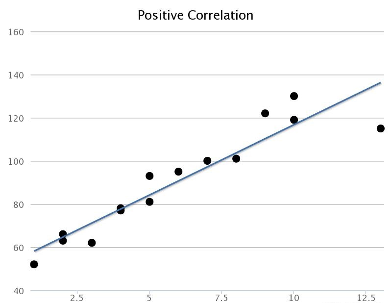
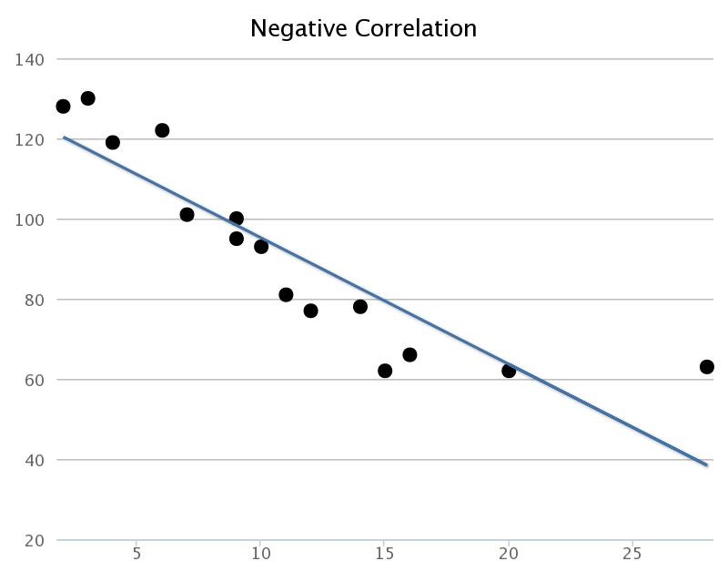
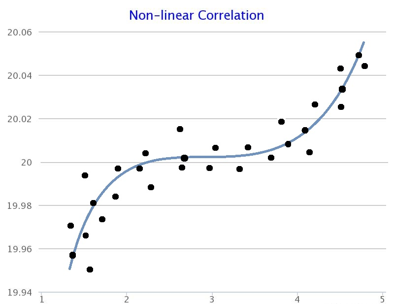
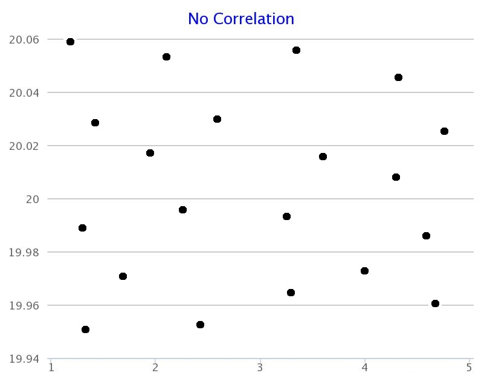

# Correlation vs. Causation

:::note
Sources

ncl.ac.uk:
[1](https://www.ncl.ac.uk/webtemplate/ask-assets/external/maths-resources/statistics/regression-and-correlation/types-of-correlation.html)
[2](https://www.ncl.ac.uk/webtemplate/ask-assets/external/maths-resources/statistics/regression-and-correlation/strength-of-correlation.html)
:::

## What is a correlation?

Correlation describes the relationship between variables. 
It can be described as either strong or weak, and as either positive or negative.

## What is causation?

The relationship between cause and effect.

:::danger
It is very important to know that correlation does **not necessarily** mean causation
:::

## Types

In statistics, the general consensus is that there are four types of correlations:

1. Positive Linear Correlation
2. Negative Linear Correlation
3. Non-linear Correlation
4. No Correlation

### Positive Linear 
We can say that tere is a positive linear correlation when the variable on the x-axis increases as the variable on the y-axis increases.

### Negative Linear 

We can say that there is a negative linear correlation when one variable increases as the other variable decreases.

### Non-linear Linear 

We can say that there is a non-linear correlation when there is a relationship between variables whilst the relationship is not linear or bent.

### No Correlation

When the points are too scattered it shows no pattern and thus no relationship could be established.

## Coefficient

"However, it is not always as easy to tell just by looking at the scatter graph, instead we quantify it using a numeric value known as **the correlation coefficient**."

There are several correlation coefficients that we can use, each has their own uses. 
We're exploring four of them:

1. Pearson correlation
2. Kendall-rank correlation
3. Spearman correlation
4. Point-biserial correlation

### Pearson

This method measures the linear relationship between two continuous variables.  
It is based on the Pearson correlation coefficient, which measures the strength and direction of the linear relationship between two variables on a scale of -1 to 1, 
where  
-1 indicates a perfect negative linear relationship,  
1 indicates a perfect positive linear relationship,  
and 0 indicates no linear relationship.

#### Formula

The Pearson correlation coefficient can be calculated using the following formula:
$$
r = \frac{n(∑xy) - (∑x)(∑y)}{\sqrt{[n∑x^2 - (∑x)^2][n∑y^2 - (∑y)^2)]}}
$$

where:

$$
n = number\ of\ data\ points
\\\
x = the\ first\ variable
\\\
y = the\ second\ variable
\\\
∑xy = the\ sum\ of\ the\ product\ of\ x\ and\ y\ values
\\\
∑x = the\ sum\ of\ x\ values
\\\
∑y = the\ sum\ of\ y\ values
\\\
∑x^2 = the\ sum\ of\ the\ square\ of\ x\ values
\\\
∑y^2 = the\ sum\ of\ the\ square\ of\ y\ values
$$

#### Example

<table class="GeneratedTable">
    <caption>Pearson Example</caption>
    <thead>
        <tr>
          <th>Height (in cm)</th>
          <th>Weight (in kg)</th>
        </tr>
    </thead>
    <tbody>
        <tr>
          <td>165</td>
          <td>60</td>
        </tr>
        <tr>
          <td>170</td>
          <td>70</td>
        </tr>
        <tr>
          <td>175</td>
          <td>80</td>
        </tr>
        <tr>
          <td>180</td>
          <td>70</td>
        </tr>
        <tr>
          <td>182</td>
          <td>75</td>
        </tr>
        <tr>
          <td>185</td>
          <td>80</td>
        </tr>
        <tr>
          <td>188</td>
          <td>85</td>
        </tr>
        <tr>
          <td>190</td>
          <td>90</td>
        </tr>
        <tr>
          <td>193</td>
          <td>95</td>
        </tr>
        <tr>
          <td>195</td>
          <td>100</td>
        </tr>
    </tbody>
</table>

$$
n = 10
\\\
x = [165, 170, 175, 180, 182, 185, 188, 190, 193, 195]
\\\
y = [60, 70, 80, 70, 75, 80, 85, 90, 95, 100]
$$
$$
∑xy =
\\\
165 * 60 + 170 * 70 + 175 * 80 + 180 * 70 + 182 * 75 +
\\\
185 * 80 + 188 * 85 + 190 * 90 + 193 * 95 + 195 * 100 
\\\ 
= 140650
$$
$$
∑x =
\\\
165 + 170 + 175 + 180 + 182 + 185 + 188 + 190 + 193 + 195
\\\
= 1865
$$
$$
\\\
∑y =
\\\
60 + 70 + 80 + 70 + 75 + 80 + 85 + 90 + 95 + 100
\\\
= 755
$$
$$
\\\
∑x^2 = 
\\\
165^2 + 170^2 + 175^2 + 180^2 + 182^2 +
\\\
185^2 + 188^2 + 190^2 + 193^2 + 195^2
\\\
= 3579025
$$
$$
\\\
∑y^2 = 
\\\
60^2 + 70^2 + 80^2 + 70^2 + 75^2 +
\\\
80^2 + 85^2 + 90^2 + 95^2 + 100^2 
\\\
= 392075
$$

$$
r = \frac{n(∑xy) - (∑x)(∑y)}{\sqrt{[n∑x^2 - (∑x)^2][n∑y^2 - (∑y)^2)]}}
\\\
\\\
r = \frac{(10 * 140650 - 1865 * 755)}{\sqrt{(10 * 3579025 - 1865^2)(10 * 392075 - 755^2)}}
\\\
\\\
r = 0.948
$$

### Kendall-rank

This method measures the rank-based relationship between two variables, regardless of the type of variables (continuous or ordinal). 
It is based on the Kendall tau coefficient and is commonly used for ordinal or interval-scaled data. 
It measures the relationship between two variables by counting the number of concordant and discordant pairs of values.

#### Example

...

### Spearman

This method measures the rank-based relationship between two variables, regardless of the type of variables (continuous or ordinal). 
It is based on the Spearman rank-order correlation coefficient and is commonly used for ordinal or interval-scaled data.
It measures the relationship between two variables by converting the data into ranks and then calculating the Pearson correlation coefficient.

#### Example

### Point-biserial

This method measures the relationship between a continuous variable and a dichotomous variable. 
It is based on the Point-biserial correlation coefficient and is used to measure the relationship between a continuous variable and a binary variable, such as pass/fail or male/female.

#### Example

## Exercise

