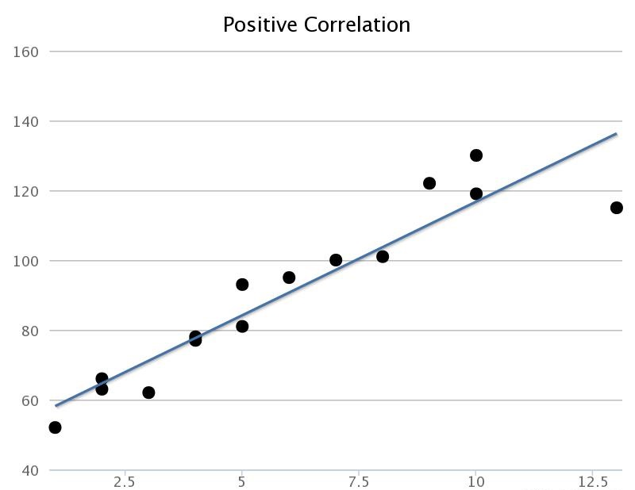
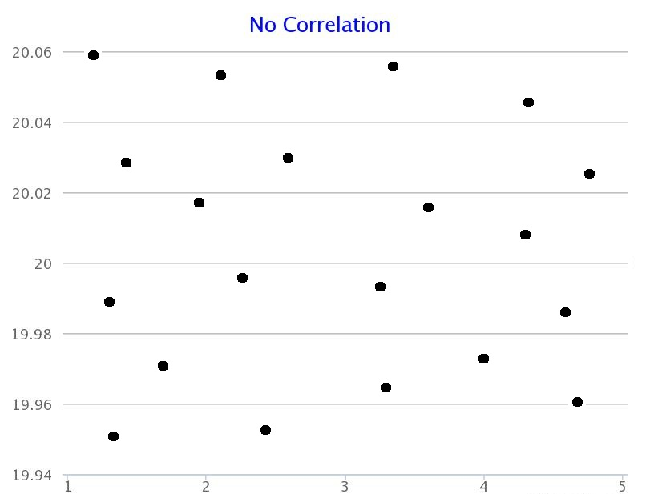

### Positive Linear 
We can say that tere is a positive linear correlation when the variable on the x-axis increases as the variable on the y-axis increases.

### Negative Linear 

We can say that there is a negative linear correlation when one variable increases as the other variable decreases.

### Non-linear Linear 

We can say that there is a non-linear correlation when there is a relationship between variables whilst the relationship is not linear or bent.

### No Correlation

When the points are too scattered it shows no pattern and thus no relationship could be established.

