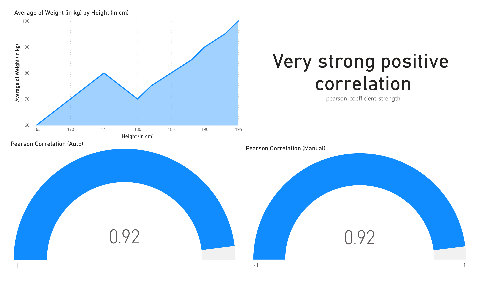

Recreate the following dashboards.

## Pearson

## Kendall

:::note
Sources:

[1](https://datakuity.com/2021/10/29/correlation-coefficient-in-power-bi-using-dax/)
[2](https://community.powerbi.com/t5/Quick-Measures-Gallery/Kendall-s-Tau/m-p/625107)

:::